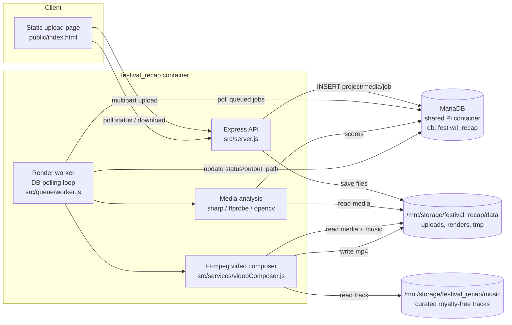
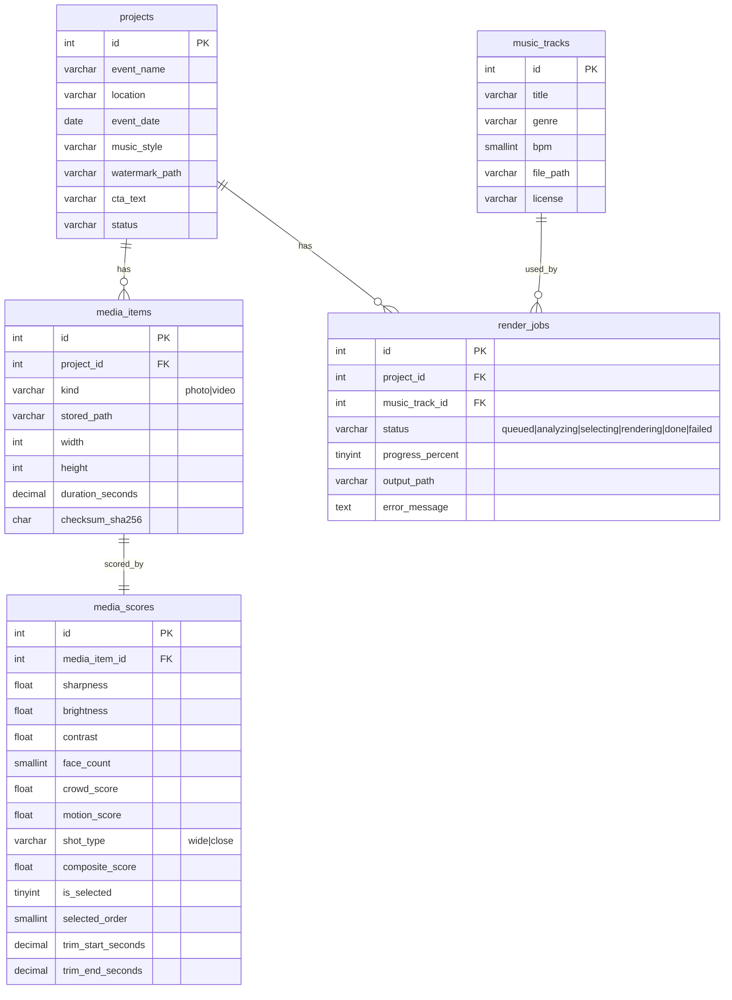
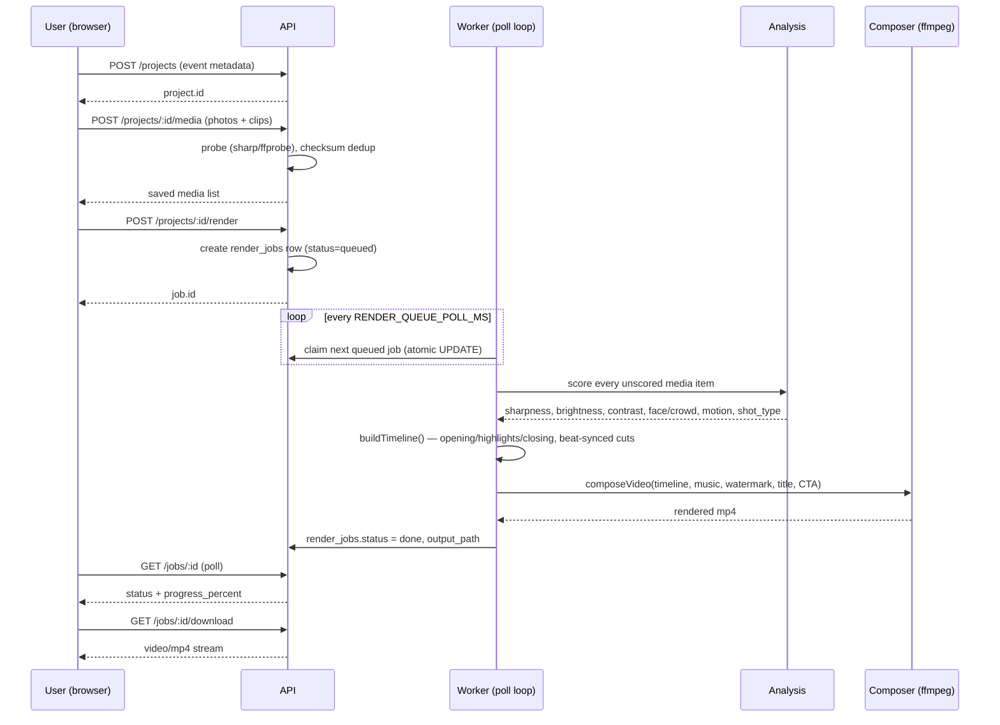

# festival_recap — Architecture

Turns user-uploaded festival photos/clips into a 20s vertical (1080x1920)
recap video, self-hosted as an independent Docker service on the Raspberry
Pi homeserver. Standalone project — no shared code, database, or containers
with Evestival or job_search beyond the one thing all three homeserver
services share: the `mariadb` container and the `web` Docker network.

---

## 1. System architecture



The API and the render worker run **in the same Node process** (one
container, `node src/server.js`). There's no Redis/BullMQ: FFmpeg encoding is
CPU-bound on a single Pi, so a distributed queue adds operational surface
without adding throughput. The worker is a poll loop over `render_jobs`
(`status='queued'`) with `RENDER_CONCURRENCY=1` — see
[docker-compose.yml](../docker-compose.yml) header and
[src/queue/worker.js](../src/queue/worker.js).

### Why MariaDB (not Postgres) and local disk (not S3)

The brief suggests PostgreSQL + S3-compatible object storage. This service
instead reuses the **existing shared `mariadb` container** on the Pi (its own
isolated database + user, no cross-database access — see
[scripts/sql/000_create_db_user.sql](../scripts/sql/000_create_db_user.sql))
and stores files directly on `/mnt/storage/festival_recap/data`. On a
single-node Pi deployment, adding Postgres or MinIO would be two more
containers to operate for no real benefit — this mirrors the `job_search`
project's conventions on the same box. If this ever needs to run across
multiple nodes, see §8 Scaling.

---

## 2. Database schema

MariaDB, InnoDB, `utf8mb4`. Full DDL: [src/db/migrations/001_init.sql](../src/db/migrations/001_init.sql).



Key design choices:
- **`media_scores` is 1:1 with `media_items`**, not embedded in it — analysis
  is a distinct, re-runnable pass (a media item can be re-scored without
  touching upload metadata).
- **`is_selected` / `selected_order`** on `media_scores` record which items
  made the final cut and in what order, so a finished job's timeline is
  always reconstructable/auditable after the fact.
- **`render_jobs` is separate from `projects`** so a project can be
  re-rendered (new music, more uploads) without losing the history of
  previous attempts.

---

## 3. API endpoints

All under `/api`. See [src/routes/](../src/routes/) for the implementation.

| Method | Path | Purpose |
|---|---|---|
| `GET`  | `/api/health` | Liveness + DB connectivity check |
| `POST` | `/api/projects` | Create a project (event name, location, date, music style, CTA text) |
| `GET`  | `/api/projects/:id` | Project details + its uploaded media list |
| `POST` | `/api/projects/:id/media` | Multipart upload — `media` (up to `MAX_UPLOAD_FILES`) + optional `watermark` |
| `POST` | `/api/projects/:id/render` | Enqueue a render job (requires ≥ 3 uploaded media items) |
| `GET`  | `/api/jobs/:id` | Job status: `queued → analyzing → selecting → rendering → done/failed`, `progress_percent` |
| `GET`  | `/api/jobs/:id/download` | Streams the finished MP4 |
| `GET`  | `/api/music` | List the *active* local royalty-free catalog (optionally `?genre=`) — used by render job track selection |
| `GET`  | `/api/music/all` | List every track (active + inactive) — used by the Music tab's library table |
| `GET`  | `/api/music/preview?url=` | Scrape a `pixabay.com/music/...` URL's metadata (title/artist/duration/license) without downloading anything |
| `POST` | `/api/music/import` | Re-scrape the URL server-side, download the mp3, auto-detect BPM from the audio (or use the supplied one), upsert the DB row — body: `{ url, genre, bpm? }` |
| `PATCH` | `/api/music/:id/active` | Toggle a track active/inactive — body: `{ active: bool }` |
| `PATCH` | `/api/music/:id` | Correct a track's `bpm`/`genre` after the fact (e.g. auto-detection was off by an octave) |

No auth layer in v1 — this is a single-operator tool behind the Pi's LAN-only
Caddy site (`tls internal`, no public exposure). Add a shared upload token or
JWT gate (pattern already used in `job_search`'s `middleware/auth.js`-style
approach) before exposing this beyond the LAN.

---

## 4. Processing workflow



### Timeline structure (matches the brief's 0-3 / 3-17 / 17-20 split)

Implemented in [src/services/selection.js](../src/services/selection.js):

- **0-3s opening** — the single highest `composite_score` item overall (the
  "wow" shot).
- **3-17s highlights** — remaining items ranked by score, interleaved
  wide/close by `shot_type` for visual rhythm, each clip's length snapped to
  the chosen track's beat grid (`60/bpm`, rounded to the nearest 1-3 beats,
  clamped 0.7-2.5s) so cuts land on-beat.
- **17-20s closing** — the best-scoring **photo** not already used (a held
  frame reads better than mid-motion video under CTA text), with the
  `cta_text` overlay burned in.

### Video composition ([src/services/videoComposer.js](../src/services/videoComposer.js))

- **Photos**: `zoompan` Ken Burns (slow zoom to 1.2x + alternating left/right
  pan per segment, direction alternates by index for variety).
- **Video clips**: trimmed to the pre-scored best window (see §5 motion
  scoring), `eq` filter for saturation/contrast/brightness lift.
- **Transitions**: `xfade` between every consecutive pair, cycling through
  `fade / wipeleft / slideup / circleopen / wiperight / slideleft` (0.35s
  each) for "fast but smooth" cuts.
- **Text**: `drawtext` (via `textfile=`, avoiding filter-string escaping
  issues) for the event title (0-3s) and the CTA (last 3s).
- **Watermark**: optional logo `overlay`'d for the full duration.
- **Audio**: the chosen music track only (no original clip audio is kept —
  ambient festival audio is rarely worth preserving over a proper track),
  trimmed to the render length with a short fade in/out.
- **Output**: `libx264` / `aac`, `-movflags +faststart`, 1080x1920 @ 30fps.

### Music library & BPM detection ([src/services/musicImport.js](../src/services/musicImport.js), [src/services/bpmDetect.js](../src/services/bpmDetect.js))

Adding a track (via the Music tab, `GET /api/music/preview` → `POST
/api/music/import`) scrapes Pixabay's per-track schema.org `AudioObject`
JSON-LD block for title/artist/duration/license and a direct CDN mp3 URL,
downloads the file into `/mnt/storage/festival_recap/music`, then **auto-detects
BPM from the actual downloaded audio** rather than asking for an external API
or a manual measurement:

1. ffmpeg low-passes the track (`lowpass=f=150`) to isolate bass/kick energy
   — the clearest beat signal for the EDM/festival/dubstep genres this tool
   targets — decoded to mono PCM at 11025Hz, a ~30s middle chunk only (skips
   the intro).
2. A short-time energy envelope (10ms windows) is autocorrelated over the
   60-200 BPM lag range; the strongest periodicity wins.
3. The normalised autocorrelation peak doubles as a rough confidence score,
   returned (not persisted) alongside the created track so the UI can show
   e.g. "128 BPM — confidence 74%".

This is a standard, well-established lightweight beat-detection technique —
no ML model, no new native dependency, fits the same CPU-only philosophy as
the media quality scoring in §5. **Known, unavoidable limitation**: naive
autocorrelation can lock onto a harmonic of the true tempo (reporting half or
double, e.g. 70 vs 140) — genuinely common with this class of detector, not
a bug to fix. The result is always editable: `PATCH /api/music/:id` corrects
`bpm`/`genre` after the fact, exposed in the Music tab as a click-to-edit
BPM cell in the library table.

No BPM source (Pixabay's page, or any other metadata site) publishes real
BPM, so before a file is downloaded (the `/preview` step) only a
genre-typical default is available — real detection can only happen after
the audio exists on disk, i.e. during `/import`.

---

## 5. AI model / analysis recommendations

The brief's scoring dimensions (sharpness, lighting, faces/crowd, action,
"emotional impact") map to a **local CPU-only baseline** in v1, with an
explicit upgrade path once/if higher accuracy is worth the added cost and
external dependency:

| Dimension | v1 (local, free, Pi-CPU) | Upgrade path (cloud, paid) |
|---|---|---|
| Sharpness | Variance-of-Laplacian via `sharp` convolve ([imageQuality.js](../src/services/imageQuality.js)) / ffmpeg `blurdetect` for video ([videoQuality.js](../src/services/videoQuality.js)) | — (local approach is already the industry-standard cheap metric; no need to upgrade) |
| Lighting (brightness/contrast) | `sharp` greyscale stats / ffmpeg `signalstats` | — (same) |
| Faces / crowd | OpenCV Haar cascade via a Python subprocess ([faceDetect.js](../src/services/faceDetect.js), [scripts/face_count.py](../scripts/face_count.py)) — count + average face size only | AWS Rekognition `DetectFaces`/`RecognizeCelebrities`, Google Cloud Vision `FACE_DETECTION`, or a proper crowd-counting model (e.g. CSRNet) if crowd density estimates matter more than a face count proxy |
| Action level | ffmpeg `signalstats` `YDIF` (mean luma delta between sampled frames) as a motion proxy | Optical flow (e.g. RAFT) or a real action-recognition model; Google Video Intelligence API's `SHOT_CHANGE_DETECTION` + `LABEL_DETECTION` |
| "Emotional impact" | Not modeled directly in v1 — approximated by the crowd + motion weighting in the composite score | A vision-language model call (e.g. a Claude or GPT-4o vision call per candidate frame, asking it to rate "festival energy" 0-10) — the highest-value/lowest-effort upgrade if budget allows, since it directly targets the subjective brief criteria the local heuristics can only proxy |

**Why local-first:** the Pi has no GPU. Running a real face/crowd model or a
vision-language model locally either doesn't fit the hardware or is too slow
per-frame for a batch of dozens of candidates. The local heuristics
(Laplacian variance, signalstats, Haar cascade) are all standard, well-proven
techniques that run in milliseconds on CPU and require zero external API
calls or cost. The composite scoring function
([mediaAnalysis.js](../src/services/mediaAnalysis.js)) is intentionally
pluggable — swapping in a cloud call for `countFaces()` or adding an
`emotionalImpact` field to the weighting is a small, isolated change, not a
rearchitecture.

**Recommendation if you do add a paid API**: gate it behind a config flag,
call it only on the analysis pass's top-N candidates by local heuristic score
(not every single upload) to control cost, and keep the local scorer as the
always-on fallback (same pattern `job_search` uses for its Anthropic/Gemini
provider fallback).

---

## 6. Node.js project structure

```
festival_recap/
├── docker/Dockerfile           # node:20-bookworm-slim + ffmpeg + python3-opencv + fonts
├── docker-compose.yml          # single service, shared mariadb, /mnt/storage volume
├── deploy/
│   ├── setup-pi.sh             # one-time bootstrap (clone, secrets, data dir)
│   └── update-pi.sh            # pull + rebuild + restart, --install-cron for retention cleanup
├── caddy/festival_recap.caddy  # Caddy site block to append to the Pi Caddyfile
├── scripts/
│   ├── sql/000_create_db_user.sql
│   ├── face_count.py           # OpenCV Haar cascade face/crowd heuristic
│   ├── seed-music.js           # loads music/library.json into music_tracks
│   └── cleanup.js              # retention cleanup (RETENTION_DAYS)
├── music/                       # BOOTSTRAP TEMPLATE ONLY — not read at runtime.
│   ├── library.json             # copied to /mnt/storage/festival_recap/music once by setup-pi.sh
│   └── README.md                # how to source/add royalty-free tracks
├── public/index.html           # minimal upload/status/preview frontend
└── src/
    ├── server.js                # Express app + starts the in-process worker loop
    ├── config/index.js
    ├── db/{pool,migrate}.js
    ├── db/migrations/001_init.sql
    ├── middleware/{errorHandler,upload}.js
    ├── repositories/{projects,mediaItems,mediaScores,renderJobs,musicTracks}.js
    ├── routes/{health,projects,jobs,music}.js
    ├── services/
    │   ├── mediaProbe.js         # width/height/duration at upload time
    │   ├── imageQuality.js       # sharpness/brightness/contrast (photos)
    │   ├── videoQuality.js       # ffprobe lavfi blurdetect+signalstats (video)
    │   ├── faceDetect.js         # Python/OpenCV subprocess wrapper
    │   ├── frameExtract.js       # grabs a representative frame from video
    │   ├── mediaAnalysis.js      # orchestrates scoring → composite_score
    │   ├── selection.js          # builds the 20s timeline
    │   ├── videoComposer.js      # ffmpeg filter_complex graph + render
    │   ├── musicImport.js        # Pixabay JSON-LD scrape + mp3 download ("Music" tab)
    │   └── bpmDetect.js          # ffmpeg lowpass + autocorrelation BPM estimate
    ├── queue/worker.js           # DB-polling render worker
    └── utils/{secrets,logger,checksum,slugify}.js
```

---

## 7. Example implementation code

The above structure **is** the example implementation, not a separate
appendix — every file listed is a working v1 (Node 20, ES modules). Start
reading at [src/server.js](../src/server.js) →
[src/queue/worker.js](../src/queue/worker.js) →
[src/services/videoComposer.js](../src/services/videoComposer.js) for the
critical path.

---

## 8. Deployment recommendations

### Local Docker deployment (primary target)

1. `deploy/setup-pi.sh` on the Pi (clone, secrets, `/mnt/storage` data + music dirs).
2. Create the DB + user in the shared `mariadb` container
   ([scripts/sql/000_create_db_user.sql](../scripts/sql/000_create_db_user.sql)).
3. Add tracks via the Music tab, or edit `/mnt/storage/festival_recap/music/library.json`
   directly and run `seed-music.js`.
4. Append the Caddy block, reload Caddy.
5. `docker compose up -d --build`.

**Resource footprint**: unlike the other lean self-hosted services on this
Pi (job_search runs at 0.5 CPU / 256M), FFmpeg encoding of a 1080x1920
multi-filter (`zoompan`+`xfade`+`eq`+`drawtext`) graph is genuinely CPU-heavy.
`docker-compose.yml` requests `cpus: 3.0` / `memory: 1536M` as a starting
point for a quad-core Pi 4/5 — tune down if other services (Caddy, MariaDB,
job_search) get starved during a render.

**Pi 4 vs Pi 5**: Pi 4 has a hardware H.264 encoder (`h264_v4l2m2m`) ffmpeg
can target; Pi 5 dropped hardware video encode entirely (VideoCore VII has no
encode block), so it's CPU-only `libx264` either way in this v1 (targeting
the lowest common denominator). If confirmed on a Pi 4, swapping
`-c:v libx264` for `-c:v h264_v4l2m2m` in
[videoComposer.js](../src/services/videoComposer.js) would meaningfully cut
render time — worth testing once real hardware is confirmed.

**Expected render time**: a 20s output with ~10-14 segments, `veryfast`
preset, CRF 21, on a Pi 4 (4× Cortex-A72 @ 1.5GHz): rough order of magnitude
1-3 minutes of wall time per video, CPU-bound. Get an actual number from a
real test render before promising users a turnaround time.

### Cloud deployment (if/when this needs to scale beyond one Pi)

Same container runs unmodified on any x86_64/ARM64 Linux host:
- **Cheapest**: a small VPS (2 vCPU / 4GB) with the same MariaDB-on-shared-host
  pattern, or point `DB_HOST` at a managed MariaDB/MySQL instance.
- **Burst rendering**: keep the API + queue table on the always-on host, but
  run the worker as a separate container/task (AWS Fargate, Cloud Run, etc.)
  that polls the same DB — the worker loop already tolerates running
  standalone (`node src/queue/worker.js`) or embedded in `server.js`; nothing
  else needs to change for this split.
- **GPU-accelerated encode**: if render volume justifies it, an
  NVENC-equipped cloud instance (e.g. a `g4dn.xlarge`) drops encode time
  drastically — swap the `libx264` output options for `-c:v h264_nvenc`.

### Estimated cost per generated video

| Resource | Pi (self-hosted) | Cloud (2 vCPU burst instance) |
|---|---|---|
| Compute | ~sunk cost + electricity (~$0.001-0.005/video @ 1-3 min CPU-bound render) | ~$0.02-0.05/video (spot/burst pricing, 1-3 min at ~$0.02-0.04/hr) |
| Storage | Local disk, effectively free until the SD/SSD fills | Object storage, negligible (<100MB/video) |
| Optional cloud vision API (§5 upgrade path) | n/a | ~$0.001-0.01 per analyzed frame, scoped to top-N candidates only |

At Pi scale (a handful of videos a day) this is essentially free. The number
that matters if this ever needs to produce "hundreds of videos automatically"
is §9 below, not per-video compute cost.

---

## 9. Scaling strategy (hundreds of videos automatically)

1. **Horizontal workers, one DB**: since the worker is a stateless poll loop
   over `render_jobs`, running N worker processes (N Pi/VPS/cloud boxes, or
   N containers on a bigger box) against the same MariaDB instance scales
   throughput linearly with no code change — `claimNextQueuedJob()`'s atomic
   `UPDATE ... WHERE status='queued'` already prevents double-claims.
2. **Move storage off local disk once >1 render node exists**: local
   `/mnt/storage` only works while a single node does the rendering (the
   worker needs the source files locally). Multi-node needs shared storage —
   NFS mount of `/mnt/storage`, or migrate `stored_path`/`output_path` to an
   S3-compatible bucket (MinIO or real S3) and have workers download-then-render.
3. **Batch/off-peak scheduling**: if "hundreds" arrive in bursts (e.g. after
   a festival weekend), queue depth naturally smooths the load — just add
   worker capacity for the burst window rather than provisioning for peak
   year-round.
4. **Pre-render reusable segments**: the opening/closing "title card" and CTA
   overlay filters are identical across every render for a given project;
   if the same watermark/CTA is reused across many events, that portion could
   be cached rather than re-encoded per job — not implemented in v1, worth it
   only past a few hundred videos/day.
5. **Cap the analysis pass, not the render pass**: analysis
   (`mediaAnalysis.js`) is the part most likely to blow up in cost if a cloud
   vision API gets added (§5) — always scope paid API calls to top-N
   candidates by the free local heuristic, never to every uploaded file.
6. **Lower-res preview render**: for user-facing "does this look right"
   feedback before committing to a final render, a 540x960 quick preview
   (same filter graph, smaller `RENDER_WIDTH`/`RENDER_HEIGHT`, `ultrafast`
   preset) costs a fraction of the final render's CPU time — worth adding
   once user iteration (not just one-shot generation) becomes a real use case.
